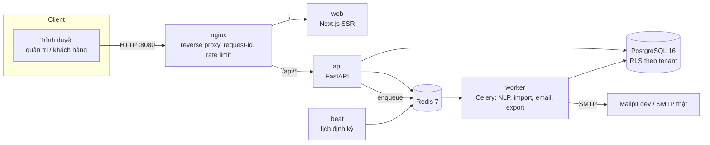

# Kiến trúc tổng quan



## Cấu trúc thư mục

```
apps/
  web/            Next.js 16 (App Router) + Tailwind 4 + shadcn/ui + next-intl
    src/app/        (marketing) landing · (auth) đăng nhập/đăng ký · (app) khu quản trị
    src/components/ ui/ (shadcn) · layout/ · feedback/ (nhãn cảm xúc, KPI, trạng thái) · marketing/
    tests/          unit (Vitest) · e2e (Playwright 375/768/1280 + axe a11y)
  api/            FastAPI — app/{core,routers,services,repositories,models,schemas,db}
  worker/         Celery worker + beat — import `app` của API để dùng chung code
packages/
  shared/         i18n (vi mặc định, en), hằng số dùng chung TS
  nlp/            Pipeline NLP tiếng Việt (GĐ 6)
infra/
  docker/         python.Dockerfile (api/worker/beat), web.Dockerfile
  nginx/          nginx.conf
docs/             decisions.md, architecture.md, progress.md, screenshots/
```

## Backend theo lớp

`routers → services → repositories → models`

- **routers**: khai báo endpoint, validate đầu vào (Pydantic), không chứa nghiệp vụ.
- **services**: nghiệp vụ; ném `AppError` (định dạng lỗi chuẩn, thông điệp tiếng Việt).
- **repositories**: truy cập dữ liệu, **bắt buộc tenant scope** (GĐ 1–2) + RLS PostgreSQL là lớp phòng thủ cuối.
- **core**: cấu hình (`pydantic-settings`), log JSON (`structlog`), middleware request-id/bảo mật, lỗi chuẩn hóa, tài nguyên vòng đời (engine DB, Redis).

## Quan sát (observability)

- Mọi log là JSON một dòng (API, uvicorn, Celery), có `request_id` xuyên suốt nginx → API.
- `X-Request-ID` của client được giữ nếu hợp lệ (8–64 ký tự an toàn), ngược lại sinh mới.
- Health: `/health` (liveness), `/api/v1/health` (readiness DB + Redis). Metrics Prometheus ở GĐ 13.

## Bảo mật đã có từ GĐ 0

- API: CORS theo danh sách trắng, header `X-Content-Type-Options`, `X-Frame-Options`, CSP `default-src 'none'`, HSTS khi production; không lộ stack trace; từ chối khởi động production nếu `SECRET_KEY`/`HASH_SALT` yếu; BCrypt cost ≥ 12 được ràng buộc trong cấu hình.
- Web: CSP, `nosniff`, `Referrer-Policy`, `Permissions-Policy`; tắt header `X-Powered-By`.
- Container chạy user không phải root; Postgres/Redis/Mailpit chỉ bind `127.0.0.1` trên máy host.
