# Sơ đồ quan hệ dữ liệu (ERD)

> Tự sinh từ model SQLAlchemy bằng `uv run python -m app.db.erd > docs/erd.md`. Không sửa tay.

- Mọi bảng có `tenant_id` đều bật **Row-Level Security** (chính sách `tenant_isolation`).
- `tenants` lọc theo `id`; `users` chỉ thấy chính mình hoặc thành viên cùng tenant.
- Bảng toàn cục (không RLS, chỉ truy cập qua phiên hệ thống): `plans`, `nlp_models`,
  `refresh_tokens`, `password_reset_tokens`.

```mermaid
erDiagram
  questions |o--o{ answers : question_id
  responses ||--o{ answers : response_id
  users |o--o{ audit_logs : user_id
  surveys |o--o{ email_deliveries : survey_id
  workspaces ||--o{ email_deliveries : workspace_id
  users |o--o{ export_jobs : created_by
  workspaces |o--o{ export_jobs : workspace_id
  users |o--o{ import_jobs : created_by
  surveys |o--o{ import_jobs : survey_id
  workspaces ||--o{ import_jobs : workspace_id
  users |o--o{ invitations : invited_by
  text_analyses ||--o{ label_corrections : analysis_id
  users |o--o{ label_corrections : reviewed_by
  users |o--o{ label_corrections : user_id
  users ||--o{ memberships : user_id
  users ||--o{ password_reset_tokens : user_id
  surveys ||--o{ questions : survey_id
  users ||--o{ refresh_tokens : user_id
  users |o--o{ report_schedules : created_by
  workspaces ||--o{ report_schedules : workspace_id
  survey_channels |o--o{ responses : channel_id
  surveys ||--o{ responses : survey_id
  survey_versions |o--o{ responses : survey_version_id
  workspaces ||--o{ responses : workspace_id
  plans ||--o{ subscriptions : plan_code
  surveys ||--o{ survey_channels : survey_id
  users |o--o{ survey_versions : published_by
  surveys ||--o{ survey_versions : survey_id
  users |o--o{ surveys : created_by
  survey_versions |o--o{ surveys : current_version_id
  workspaces ||--o{ surveys : workspace_id
  plans ||--o{ tenants : plan_code
  answers |o--o{ text_analyses : answer_id
  responses ||--o{ text_analyses : response_id
  surveys ||--o{ text_analyses : survey_id
  users |o--o{ text_analyses : verified_by
  workspaces ||--o{ text_analyses : workspace_id
  text_analyses |o--o{ tickets : analysis_id
  users |o--o{ tickets : assignee_id
  responses |o--o{ tickets : response_id
  workspaces ||--o{ tickets : workspace_id
  workspaces ||--o{ topic_sets : workspace_id
  topic_sets ||--o{ topics : topic_set_id
  workspaces ||--o{ topics : workspace_id
  users ||--o{ workspace_members : user_id
  workspaces ||--o{ workspace_members : workspace_id
  users |o--o{ workspaces : created_by
  answers {
    uuid response_id FK
    uuid question_id FK
    string question_code
    string question_type
    jsonb value
    text text_value
    uuid id PK
    uuid tenant_id FK
    datetime created_at
  }
  audit_logs {
    uuid user_id FK
    string action
    string entity_type
    string entity_id
    jsonb data
    string ip_hash
    string request_id
    uuid id PK
    uuid tenant_id FK
    datetime created_at
  }
  email_deliveries {
    uuid workspace_id FK
    uuid survey_id FK
    string recipient
    string kind
    string dedupe_key
    jsonb payload
    enum status
    integer attempts
    datetime next_attempt_at
    datetime sent_at
    datetime opened_at
    datetime clicked_at
    string last_error
    uuid id PK
    uuid tenant_id FK
    datetime created_at
    datetime updated_at
  }
  export_jobs {
    uuid workspace_id FK
    enum kind
    enum status
    jsonb params
    string file_key
    string filename
    text error_message
    uuid created_by FK
    datetime finished_at
    datetime expires_at
    uuid id PK
    uuid tenant_id FK
    datetime created_at
    datetime updated_at
  }
  import_jobs {
    uuid workspace_id FK
    uuid survey_id FK
    enum kind
    enum status
    string original_filename
    string file_key
    jsonb mapping
    integer total_rows
    integer processed_rows
    integer success_rows
    integer error_rows
    string error_report_key
    text error_message
    uuid created_by FK
    datetime started_at
    datetime finished_at
    uuid id PK
    uuid tenant_id FK
    datetime created_at
    datetime updated_at
  }
  invitations {
    string email
    enum role
    array workspace_ids
    string token_hash UK
    uuid invited_by FK
    datetime expires_at
    datetime accepted_at
    datetime revoked_at
    uuid id PK
    uuid tenant_id FK
    datetime created_at
  }
  label_corrections {
    uuid analysis_id FK
    uuid user_id FK
    enum field
    jsonb old_value
    jsonb new_value
    string reason
    string model_version
    datetime reverted_at
    boolean used_for_training
    enum review_status
    uuid reviewed_by FK
    datetime reviewed_at
    uuid id PK
    uuid tenant_id FK
    datetime created_at
  }
  memberships {
    uuid user_id FK
    enum role
    enum status
    boolean all_workspaces
    uuid id PK
    uuid tenant_id FK
    datetime created_at
    datetime updated_at
  }
  nlp_models {
    string task
    string version
    string backend
    jsonb metrics
    string artifact_path
    boolean is_active
    text notes
    uuid id PK
    datetime created_at
  }
  password_reset_tokens {
    uuid user_id FK
    string token_hash UK
    datetime expires_at
    datetime used_at
    uuid id PK
    datetime created_at
  }
  plans {
    string code PK
    string name
    integer price_vnd
    jsonb limits
    integer sort_order
    boolean is_active
    datetime created_at
    datetime updated_at
  }
  questions {
    uuid survey_id FK
    string type
    string code
    jsonb title
    jsonb description
    jsonb options
    jsonb config
    jsonb logic
    integer position
    boolean required
    numeric points
    uuid id PK
    uuid tenant_id FK
    datetime created_at
    datetime updated_at
  }
  refresh_tokens {
    uuid user_id FK
    uuid tenant_id FK
    uuid family_id
    string token_hash UK
    datetime expires_at
    datetime revoked_at
    uuid replaced_by_id
    string user_agent
    string ip_hash
    uuid id PK
    datetime created_at
  }
  report_schedules {
    uuid workspace_id FK
    uuid created_by FK
    array recipients
    string cadence
    jsonb filters
    datetime next_run_at
    boolean enabled
    uuid id PK
    uuid tenant_id FK
    datetime created_at
    datetime updated_at
  }
  responses {
    uuid survey_id FK
    uuid workspace_id FK
    uuid survey_version_id FK
    enum channel
    uuid channel_id FK
    jsonb source_params
    jsonb respondent
    string language
    enum status
    datetime started_at
    datetime submitted_at
    integer duration_seconds
    string fingerprint_hash
    string ip_hash
    numeric rating
    numeric csat
    smallinteger nps
    numeric score
    string external_id
    uuid id PK
    uuid tenant_id FK
    datetime created_at
  }
  subscriptions {
    string plan_code FK
    string status
    datetime current_period_start
    datetime current_period_end
    string provider
    string provider_ref
    uuid id PK
    uuid tenant_id FK
    datetime created_at
    datetime updated_at
  }
  survey_channels {
    uuid survey_id FK
    string name
    enum channel
    string code
    jsonb params
    uuid id PK
    uuid tenant_id FK
    datetime created_at
  }
  survey_versions {
    uuid survey_id FK
    integer version
    jsonb snapshot
    uuid published_by FK
    uuid id PK
    uuid tenant_id FK
    datetime created_at
  }
  surveys {
    uuid workspace_id FK
    string title
    text description
    enum status
    string slug UK
    jsonb theme
    jsonb settings
    array languages
    string default_language
    boolean is_quiz
    uuid current_version_id FK
    datetime published_at
    datetime closed_at
    datetime opens_at
    datetime closes_at
    integer response_count
    uuid created_by FK
    uuid id PK
    uuid tenant_id FK
    datetime created_at
    datetime updated_at
    datetime deleted_at
  }
  tenants {
    string name
    string slug UK
    string industry
    enum status
    string plan_code FK
    jsonb settings
    uuid id PK
    datetime created_at
    datetime updated_at
    datetime deleted_at
  }
  text_analyses {
    uuid response_id FK
    uuid answer_id FK,UK
    uuid workspace_id FK
    uuid survey_id FK
    enum channel
    numeric rating
    datetime responded_at
    text text
    text normalized_text
    enum sentiment
    float sentiment_score
    jsonb sentiment_detail
    array topic_ids
    jsonb topic_scores
    boolean is_urgent
    jsonb urgent_reasons
    array keywords
    string model_version
    integer topic_set_version
    enum status
    integer attempts
    string last_error
    datetime analyzed_at
    boolean is_verified
    uuid verified_by FK
    datetime verified_at
    text note
    uuid id PK
    uuid tenant_id FK
    datetime created_at
    datetime updated_at
  }
  tickets {
    uuid workspace_id FK
    uuid response_id FK
    uuid analysis_id FK,UK
    string title
    enum status
    enum priority
    uuid assignee_id FK
    datetime due_at
    datetime resolved_at
    jsonb notes
    uuid id PK
    uuid tenant_id FK
    datetime created_at
    datetime updated_at
  }
  topic_sets {
    uuid workspace_id FK,UK
    string name
    string template_code
    integer version
    uuid id PK
    uuid tenant_id FK
    datetime created_at
    datetime updated_at
  }
  topics {
    uuid workspace_id FK
    uuid topic_set_id FK
    string name
    text description
    array keywords
    string color
    integer sort_order
    boolean is_active
    uuid id PK
    uuid tenant_id FK
    datetime created_at
    datetime updated_at
  }
  users {
    string email UK
    string password_hash
    string full_name
    string locale
    boolean is_superadmin
    datetime email_verified_at
    integer failed_login_count
    datetime locked_until
    datetime last_login_at
    integer token_version
    uuid id PK
    datetime created_at
    datetime updated_at
    datetime deleted_at
  }
  workspace_members {
    uuid workspace_id FK
    uuid user_id FK
    uuid id PK
    uuid tenant_id FK
    datetime created_at
  }
  workspaces {
    string name
    text description
    string industry
    string color
    jsonb settings
    uuid created_by FK
    uuid id PK
    uuid tenant_id FK
    datetime created_at
    datetime updated_at
    datetime deleted_at
  }
```

## Bảng chịu RLS theo tenant

`answers`, `audit_logs`, `email_deliveries`, `export_jobs`, `import_jobs`, `invitations`, `label_corrections`, `memberships`, `questions`, `report_schedules`, `responses`, `subscriptions`, `survey_channels`, `survey_versions`, `surveys`, `text_analyses`, `tickets`, `topic_sets`, `topics`, `workspace_members`, `workspaces`
